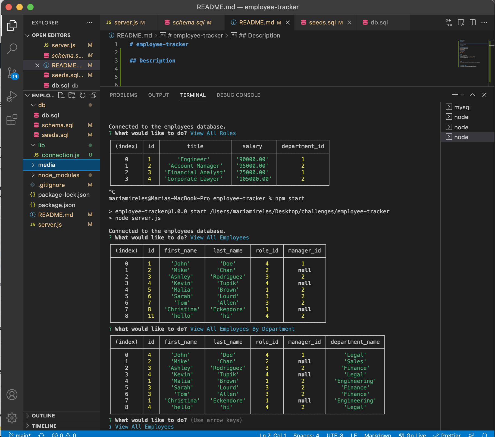

# employee-tracker

## Description 

### Full movie
[movie](https)

## Table of Contents (Optional)

* [Installation](#installation)
* [Usage](#usage)
* [Credits](#credits)
* [License](#license)

## Installation
`npm install inquirer` >
`npm i mysql2` >
`npm i console.table`

## Usage 

To use the employee-tracker
1. Open the terminal 
2. In the root of your directory run `npm start` command
3. Answer the prompt questions.
4. SQL database tables will show based on user selection. 

---

🏆 
## Badges

## Contributing / Credits

[mariamv29](https://github.com/mariamv29/README-generator.git)
